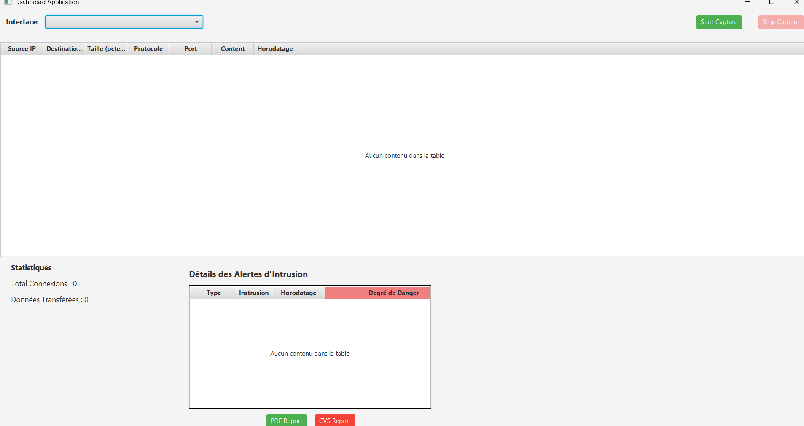

# 🚦 Application de Surveillance du Trafic Réseau

 
  

📡 Une application développée en **Java & JavaFX** pour surveiller et analyser le trafic réseau en temps réel.

---

## 📌 **Table**
- [ Description](#-description)
- [ Objectifs](#-objectifs)
- [ Fonctionnalités](#-fonctionnalités)
- [ Architecture](#-architecture)
- [ Technologies Utilisées](#-technologies-utilisées)
- [ Aperçu](#-aperçu)
- [ Installation](#-installation)
- [ Auteurs](#-auteurs)


---

## 📖 **Description**
Avec la montée des cyberattaques, il est essentiel d'avoir un outil performant pour **analyser le trafic réseau, détecter les menaces**, et prendre des mesures préventives.  
Notre application permet de **capturer les paquets réseau** et d'afficher en temps réel les connexions suspectes.


---

## 🎯 **Objectifs**
✅ Détecter les **activités suspectes** comme les attaques **DoS** ou les **balayages de ports**.  
✅ Fournir une **interface intuitive** pour visualiser les connexions actives et les alertes.  
✅ Générer des **rapports détaillés** sur les menaces détectées.  

---

## 📜 **Fonctionnalités**
🔍 **Analyse du trafic** en temps réel avec détection d'anomalies.  
📊 **Interface graphique (UI)** interactive basée sur JavaFX.  
📑 **Génération de rapports** sous différents formats (PDF, CSV).  
🛑 **Alertes en cas d'activité suspecte** (ex. : attaque DDoS).  
📡 **Visualisation graphique du trafic réseau**.  

---

## 🏛️ **Architecture**
L'application suit le modèle **MVC** (Modèle-Vue-Contrôleur) :

📂 **Modèle (Model)** → Gestion des paquets et analyse du trafic.  
🎨 **Vue (View)** → Interface utilisateur (JavaFX + FXML).  
🔗 **Contrôleur (Controller)** → Gestion des interactions et mise à jour de l'UI.  

---

## 🛠️ **Technologies Utilisées**
🚀 **Langage** : Java (JDK 21)  
🎨 **Framework UI** : JavaFX  
📡 **Bibliothèque réseau** : Pcap4J  
🛠️ **IDE** : IntelliJ IDEA  
📂 **Gestion de version** : Git, GitHub  

---
## 📸 **Aperçu**


---

## 🚀 **Installation**
1️⃣ **Cloner le dépôt** :
```bash
git clone https://github.com/Drissrad/JavaFX-Network-Intrusion-Detection.git
---

👥 Auteurs
👨‍💻 Driss Ait Maali
👨‍💻 Ayoub Fanoui

